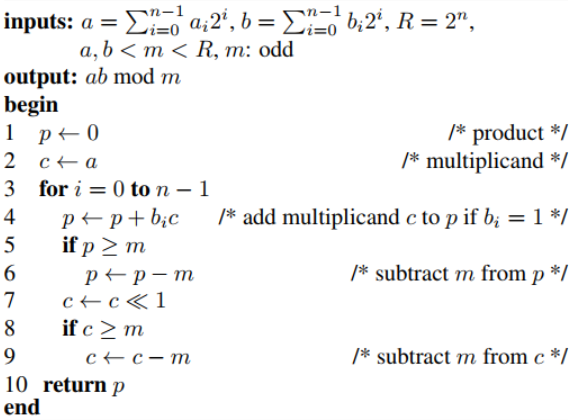
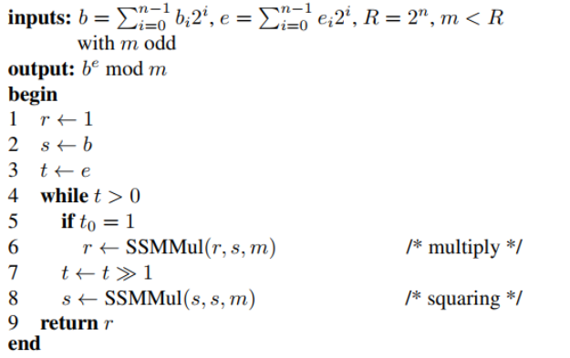
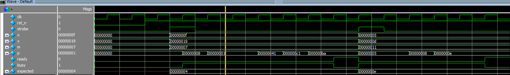
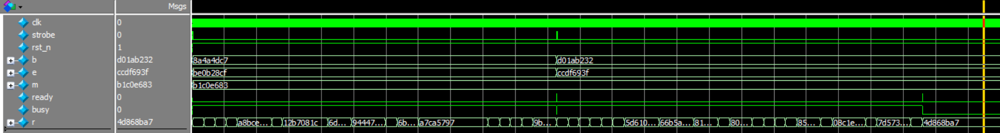
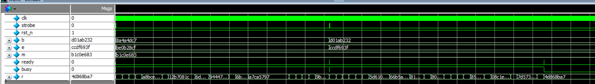

## 📌 Project Objectives

- Study the **RSA-1024 encryption algorithm**
- Study the **Wishbone bus protocol**
- Design the **RTL architecture using Verilog HDL**
- Develop **testbenches in Verilog HDL** and perform **functional simulation and verification**
- Perform **post-synthesis simulation**

---

## 🔐 1️⃣ Design Idea: Modular Exponentiation for RSA

In RSA encryption, the ciphertext is computed as:

`C = M^e mod n`

where:
- `M` is the plaintext  
- `e` is the public exponent  
- `n` is the modulus  

### Modular Exponentiation Methods

Two common methods are used for modular exponentiation:

- **Basic modular exponentiation**, which performs repeated modular multiplications with a time complexity of `O(e)`
- **Square-and-Multiply**, which reduces the complexity to `O(log2(e))` and is widely used in practical RSA implementations

Both methods rely heavily on **modular multiplication**, defined as:

`Z = (A × B) mod N`

---

### Design Challenge

Direct modular multiplication requires:
- Large bit-width multipliers (e.g., 1024-bit)
- Division by `N`, which is **hardware-expensive**

This results in **high area and power consumption** when implemented directly in hardware.

---

### Design Objective

To improve hardware efficiency, this design focuses on:
- Eliminating costly division operations  
- Reducing multiplier complexity  

Therefore, the **Shift–Sub Modular Multiplication (SSMM)** algorithm is adopted.  
SSMM replaces division with **shift and conditional subtraction**, making it well-suited for **hardware-based RSA acceleration**.

---

## ⚙️ 2️⃣ Algorithm: Modular Exponentiation Using SSMM

---

### 2.1 SSMMul(a, b, m) Shift-Sub Modular Multiplication

  

---

### 2.2 SSExpMul(b, e, m) Modular Exponentiation using SSMMul()

  

---
## 🔌 3️⃣ Wishbone Interface

The RSA-1024 accelerator is integrated into the system using the **Wishbone bus protocol**, allowing seamless communication with a host processor or controller.

---

### Wishbone Overview

Wishbone is an open-source on-chip interconnect standard that supports:
- Simple and flexible bus transactions  
- Synchronous, single-master operation  
- Memory-mapped register access  

The RSA accelerator acts as a **Wishbone slave**, controlled by a master through read/write transactions.

## 📊 4️⃣ Results

This section presents the **implementation and verification results** of the **RSA-1024 hardware accelerator** with **Wishbone interface**.

---

### 4.1 Functional Simulation Results

Functional simulation is performed to verify the correctness of:
- **SSMMul** (modular multiplication)

  

- SSExpMul (modular exponentiation)

  

- SSExpMul with Wishbone slave 

  

